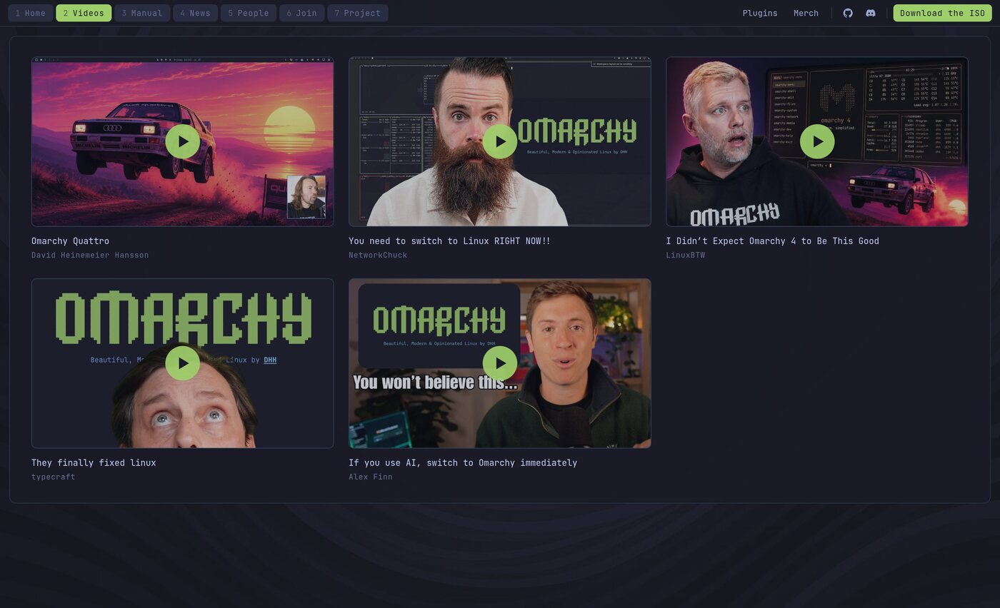
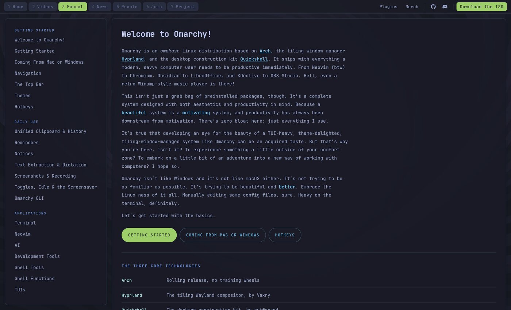
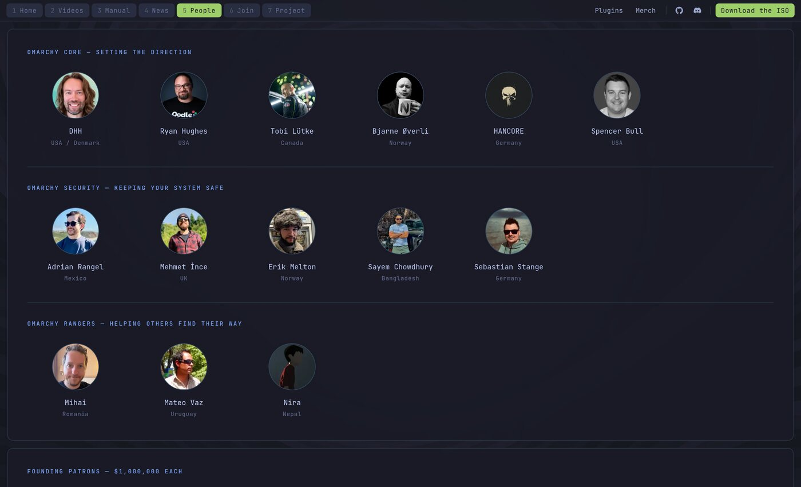
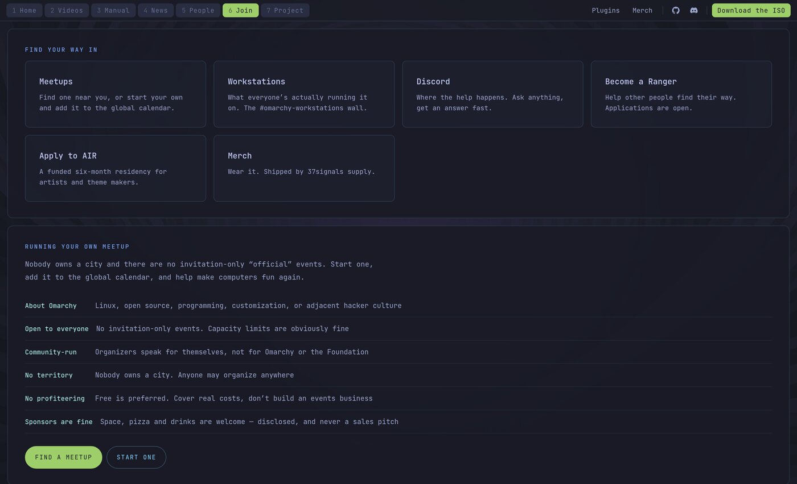
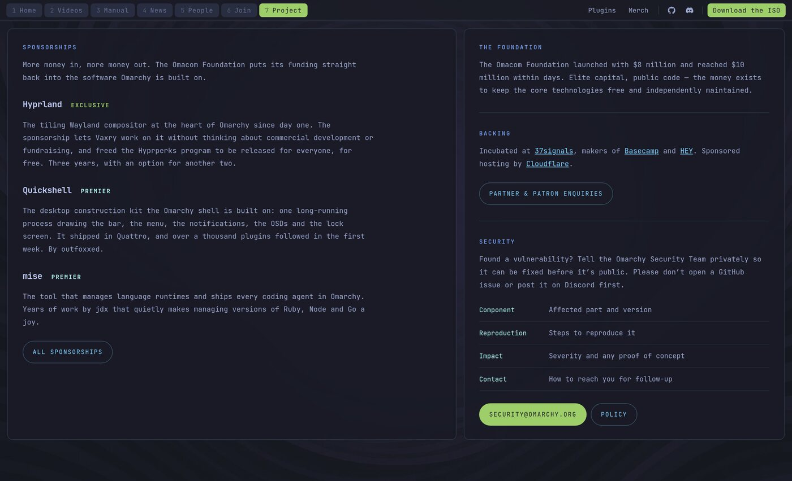

# Omarchy — homepage redesign

A redesign of [omarchy.org](https://omarchy.org) where the website looks like the desktop
the distro actually ships: a bar across the top, tiled panes with Hyprland-style gaps, and
workspaces as the pages.

**[See it live → omarchy-frontpage.pages.dev](https://omarchy-frontpage.pages.dev)**


## The pages

| # | Page | |
|---|------|--|
| 1 | Home | The pitch, the ISO, two featured videos |
| 2 | Videos | All five videos currently on omarchy.org |
| 3 | Manual | All 51 sections, contents pinned beside the text |
| 4 | News | The ten most recent posts |
| 5 | People | Core, Security, Rangers, Founding Patrons, AIR |
| 6 | Join | Ways in, and the rules for running a meetup |
| 7 | Project | Sponsorships, backing, security policy |

### Videos



### Manual



### People



### Join



### Project



## Running it

```sh
python3 -m http.server 8471      # then open http://localhost:8471
```

Static files, no build step, no dependencies.

## Building

```sh
python3 build.py
```

Inlines the CSS, JS and images into `dist/index.html` — one self-contained file, handy for
sharing but not for deployment, where per-asset caching is better.

## Layout

```
index.html              markup and all page content
assets/css/shell.css    tokens, bar, workspaces, panes, content primitives
assets/js/shell.js      routing, keyboard, mobile drawer, video facades
assets/img/             wallpaper, video thumbnails, team photos
docs/                   the screenshots above
build.py                single-file inliner
```
