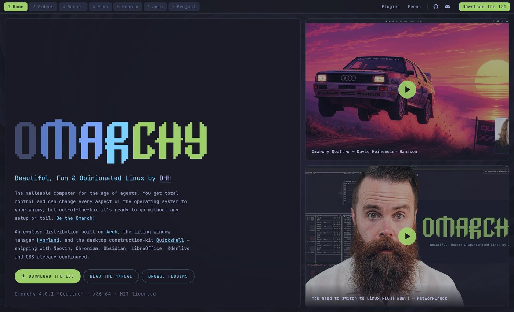

# Omarchy — homepage redesign

A redesign of [omarchy.org](https://omarchy.org) where the website looks like the desktop
the distro actually ships: a bar across the top, tiled panes with Hyprland-style gaps, and
workspaces as the pages.



## The pages

| # | Page | |
|---|------|--|
| 1 | Home | The pitch, the ISO, two featured videos |
| 2 | Videos | All five videos currently on omarchy.org |
| 3 | Manual | All 51 sections, contents pinned beside the text |
| 4 | News | The ten most recent posts |
| 5 | People | Core, Security, Rangers, Founding Patrons, AIR |
| 6 | Join | Ways in, and the rules for running a meetup |
| 7 | Project | Sponsorships, backing, security policy |

### Videos


### Manual

The contents list is capped to the viewport and scrolls on its own, so 51 entries never
dictate the height of the page beside it.


### People


### Join


### Project


## Details

- **One typeface**, JetBrains Mono — the face Omarchy already uses.
- **The wordmark** is the official `/brand/` SVG, which is a real pixel grid of 211 rects on
  51px cells. It is expanded to its 738 cells and coloured per letter group, so the gradient
  steps with the pixels rather than sitting underneath them.
- **Videos load on click.** Nothing third-party is requested on first paint.
- **Content is real**, taken from the live site. Every link points at its real destination.
- Below 900px the tiling gives up: panes stack, and the bar collapses to a hamburger.

## Running it

```sh
python3 -m http.server 8471      # then open http://localhost:8471
```

Static files, no build step, no dependencies.

## Building

```sh
python3 build.py
```

Inlines the CSS, JS and images into `dist/index.html` — one self-contained file, handy for
sharing but not for deployment, where per-asset caching is better.

## Layout

```
index.html              markup and all page content
assets/css/shell.css    tokens, bar, workspaces, panes, content primitives
assets/js/shell.js      routing, keyboard, mobile drawer, video facades
assets/img/             wallpaper, video thumbnails, team photos
docs/                   the screenshots above
build.py                single-file inliner
```
